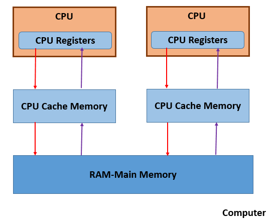
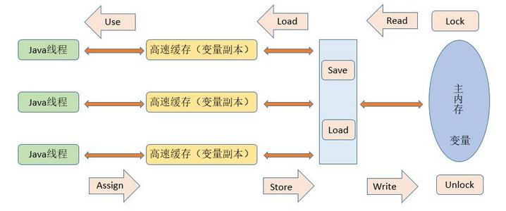

### 现代计算机硬件架构的简单图示

#### 多个CPU  
#### CPU寄存器  
#### 高速缓存Cache  
#### 内存  

由于计算机的存储设备与处理器的运算能力之间有几个数量级的差距，所以现代计算机系统都不得不加入一层读写速度尽可能接近处理器运算速度的高速缓存(cache)来作为内存与处理器之间的缓冲：将运算需要使用到的数据复制到缓存中，让运算能快速进行，当运算结束后再从缓存同步回内存之中，这样处理器就无需等待缓慢的内存读写了。
基于高速缓存的存储交互很好地解决了处理器与内存的速度矛盾，但是引入了一个新的问题：缓存一致性（Cache Coherence）。在多处理器系统中，每个处理器都有自己的高速缓存，而他们又共享同一主存，如下图所示：多个处理器运算任务都涉及同一块主存，需要一种协议可以保障数据的一致性，这类协议有MSI、MESI、MOSI及Dragon Protocol等。
除此之外，为了使得处理器内部的运算单元能尽可能被充分利用，处理器可能会对输入代码进行乱序执行（Out-Of-Order Execution）优化，处理器会在计算之后将对乱序执行的代码进行结果重组，保证结果准确性。与处理器的乱序执行优化类似，Java虚拟机的即时编译器中也有类似的指令重排序（Instruction Recorder）优化。

### Java内存模型(Java Memory Model, JMM)
Java虚拟机规范中定义了Java内存模型(Java Memory Model，JMM),用于屏蔽掉各种硬件和操作系统的内存访问差异，以实现让Java程序在各种平台下都能达到一致的并发效果，JMM规范了Java虚拟机与计算机内存是如何协同工作的：规定了一个线程如何和何时可以看到由其他线程修改过后的共享变量的值，以及在必须时如何同步的访问共享变量.

