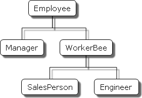

# Details of the object model  

> JavaScript不是基于class，而是基于object的语言。由于这个原因，创建一个继承关系就变得不是特别显而易见。  

## 基于Class的语言与基于object的语言的区别  

1. 基于class的语言清楚的区分类与实例。*class* 就是某一类物体的抽象，包括属性，方法。*instance* 就是某个类一个具体的实例。

2. 基于object的语言，不区分 *class* 与 *instance* , 但是有原型对象( *prototypical object* )的概念。任何一个对象可以拥有自己的属性，也可以在runtime的时候创建自己的属性。任何一个对象A都可以作为另外一个对象B的prototype，在B对象中可以共享A的属性。  

3. JavaScript使用*Function*关键字定义一个类，通过使用*new*关键字创建一个新的对象。

4. Javascript使用*prototypical object* 实现继承。

5. 基于*class*的语言在创建类之后不能改变类的属性。基于*object*的语言可以在运行时为一个对象添加或者删除属性。如果为一个父类添加属性，子类也会拥有相同的属性。

## The employee example

