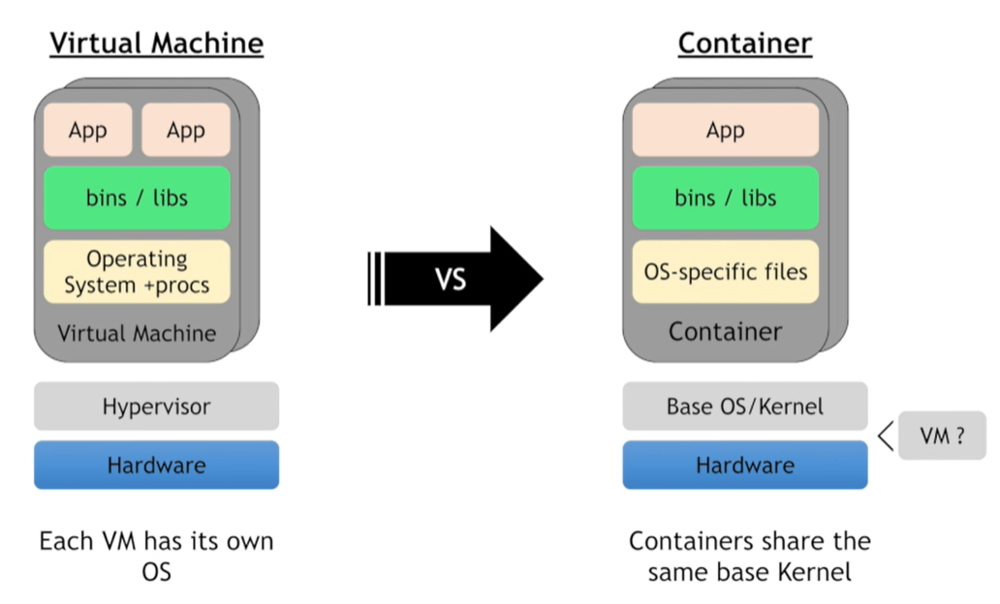
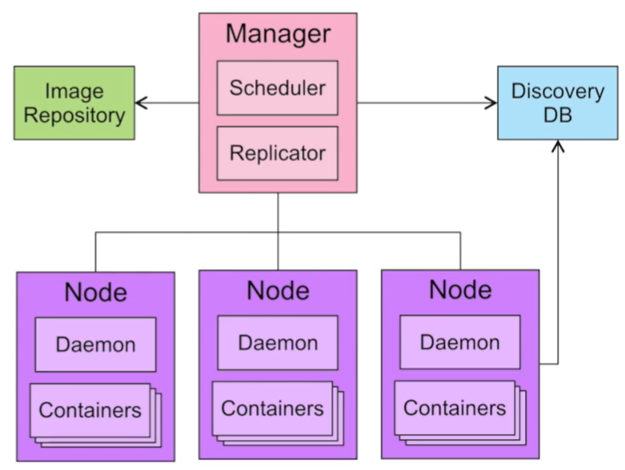
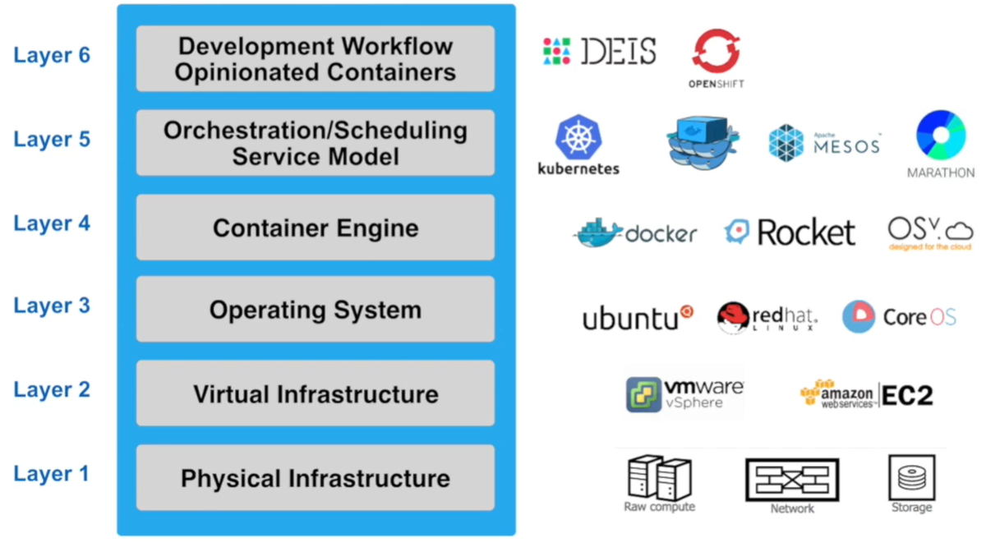

# Docker Training

## Objectives

### What containers are and their benefits

### How to find and run Docker containers from the Docker Hub

### How to create your first Docker container and understand the layering and union file system

### The best practices when developing Dockerfiles

### How to solve problems of orchestration: reconciliation, scaling, high availability, and service discovery

### Some of the tools that can help you run highly available applications in production, such as the IBM Container service

## Prerequisites

You don't need to know anything about containers to take this course, and no extensive programming experience is required. However, you must know how to run command-line tools from your workstation.

## Course labs

### Install Docker or use Play-With-Docker

#### Install Docker

1. Navigate to http://store.docker.com.
2. Select Community Edition.
3. Select the filters for your operating system or platform and install Docker.

#### Play-With-Docker


-- slide 

## What are Containers

- A group of processes run in isolate
  - All processes MUST be able to run on the shared keenel
  
- Each container has it own set of 'namespaces' (isolate view)
  - PID - process ids
  - USER - user and group IDs
  - UTS - hostname and domain name
  - NS - mount points
  - NET - Network devices, stacks, ports
  - IPC - inter-process communications, message queues
- cgroups - controls limits and monitoring of resources
  
-- slide

VM vs Container



-- slide

## What is Docker

- At its core, Docker is tooling to manage contains
  - Simplified existing technology to enable it for the masses
- Ebable developers to use the containers for their application
    - Package dependencies with containers: "build once, run anywhere"


-- slide

## What Containers are Appealing to Users

Containers are just a process (or a group of processes) running in isolation, which is achieved with Linux namespaces and control groups. Linux namespaces and control groups are features that are built into the Linux kernel. Other than the Linux kernel itself, there is nothing special about containers.

- No more "Works on my machine"
- Lightweight and fast
- Better resources utilization
  - Can fit far more containers than VMs into a host
- Standard developer to operations interface
- Ecosystem and tooling

-- slide

## Run a Container

Use the Docker CLI to run your first container.

1. Open a terminal on your local computer and run this command:

```
docker run -t ubuntu top
```

You use the docker container run command to run a container with the Ubuntu image by using the top command. The -t flag allocates a pseudo-TTY, which you need for the top command to work correctly. The docker run command first starts a docker pull to download the Ubuntu image onto your host. After it is downloaded, it will start the container. 

top is a Linux utility that prints the processes on a system and orders them by resource consumption. Notice that there is only a single process in this output: it is the top process itself. You don't see other processes from the host in this list because of the PID namespace isolation.

Containers use Linux namespaces to provide isolation of system resources from other containers or the host. The PID namespace provides isolation for process IDs. If you run top while inside the container, you will notice that it shows the processes within the PID namespace of the container, which is much different than what you can see if you ran top on the host.

Even though we are using the Ubuntu image, it is important to note that the container does not have its own kernel. It uses the kernel of the host and the Ubuntu image is used only to provide the file system and tools available on an Ubuntu system.

2. Inspect the container:

```
docker ps 
docker exec -it <container_id> bash

ps -ef
```

PID is just one of the Linux namespaces that provides containers with isolation to system resources. Other Linux namespaces include:

MNT: Mount and unmount directories without affecting other namespaces.
NET: Containers have their own network stack.
IPC: Isolated interprocess communication mechanisms such as message queues.
User: Isolated view of users on the system.
UTC: Set hostname and domain name per container.
These namespaces provide the isolation for containers that allow them to run together securely and without conflict with other containers running on the same system.

-- slide

1. Run an NGINX server by using the official NGINX image from the Docker Store:

```
docker run --detach --publish 8080:80 --name nginx nginx

docker run -d -p 8080:80 --name nginx nginx
```
**Tip:**  The --detach flag will run this container in the background, Specifying your own name makes it easier to run subsequent commands on your container because you can reference the name instead of the id of the container

2. Access the NGINX server on http://localhost:8080.
3. Run a MongoDB server. 

```
docker run -d -p 8081:27017 --name mongo mongo:3.4
```

4. Access http://localhost:8081 to see some output from Mongo.

5. Check your running containers:

```
ps 
```

--slide

## Remove containers

```
docker stop <container_id/container_name>
docker rm <container_id/container_name>

docker volume prune -f
docker network prune -f
docker system prune -f
```

-- slide
## Docker Registry

- Push and pull images from registry
- Default registry: Docker hub
  - Public and free for public images
  - Many pre-packaged images available
- Private registry
  - Self-host or cloud provider options

-- slide

## Creating a Docker image - with Docker build
- Create a "Dockerfile"
  - List of instructions for how to construct the container

- Build a image from a Docker file

```
docker build -f <docker_file>
```

- cat Dockerfile
  
```
FROM ubuntu
ADD myapp /
EXPOSE 80
ENTRYPOINT /myapp
```

-- slide

## Docker image layers

- union file system
  - Merge image layers into single file system for each container
- copy-on-write
  - copies files that are edited up to top writable layer
  
- advantages
  - More containers per host(save $$ on infrastructure)
  - Faster start-up/download time - base layers are cached

-- slide

## Create a Python app (without using Docker)

1. Write the python app
```
cat > app.py <<-EOF
from flask import Flask
app = Flask(__name__)
@app.route("/")
def hello():
    return "hello world!"

if __name__ == "__main__":
    app.run(host="0.0.0.0")
EOF
```

**Tip:** This is a simple Python app that uses Flask to expose an HTTP web server on port 5000.

2. Create the docker image from a Docker file

```
cat > Dockerfile <<-EOF
> FROM python:3.6.1-alpine
> RUN pip install flask
> CMD ["python","app.py"]
> COPY app.py /app.py
> EOF
```

3. Build the Docker image. Pass in the -t parameter to name your image python-hello-world.

```
docker build -t python-hello-world .
```

4. Verify that your image shows in your image list:

```
docker image ls
```

5. Run the Docker image

```
docker run -p 5001:5000 -d python-hello-world
```

6. Navigate to http://localhost:5001 in a browser to see the results.

7. Check the log output of the container.

```
docker logs <container_id>
```

-- slide

## Push to a centry registry

1. Log in to the Docker registry account by entering docker login on your terminal:

```
docker login
```

2. Tag the image with your username.

```
docker tag python-hello-world [dockerhub username]/python-hello-world
```

1. After you properly tag the image, use the docker push command to push your image to the registry:

```
docker push <image_name:tag>
```


--slide 

## Deploy a change

1. Update the python app

```
cat > app.py <<-EOF
from flask import Flask
app = Flask(__name__)
@app.route("/")
def hello():
    return "hello Python world!"

if __name__ == "__main__":
    app.run(host="0.0.0.0")
EOF
```

-- slide

## Understand image layers

Each of these lines is a layer. Each layer contains only the delta, or changes from the layers before it. To put these layers together into a single running container, Docker uses the union file system to overlay layers transparently into a single view.

Each layer of the image is read-only except for the top layer, which is created for the container. The read/write container layer implements "copy-on-write," which means that files that are stored in lower image layers are pulled up to the read/write container layer only when edits are being made to those files. Those changes are then stored in the container layer.

The "copy-on-write" function is very fast and in almost all cases, does not have a noticeable effect on performance. You can inspect which files have been pulled up to the container level with the docker diff command. For more information, see the command-line reference on the docker diff command.

Because image layers are read-only, they can be shared by images and by running containers.

To look more closely at layers, you can use the docker image history command of the Python image you created.

```
docker diff <container_id/container_name>
docker image history python-hello-world
```

-- slide

- Use the Dockerfile to create reproducible builds for your application and to integrate your application with Docker into the CI/CD pipeline.
- Docker images can be made available to all of your environments through a central registry. The Docker Hub is one example of a registry, but you can deploy your own registry on servers you control.
- A Docker image contains all the dependencies that it needs to run an application within the image. This is useful because you no longer need to deal with environment drift (version differences) when you rely on dependencies that are installed on every environment you deploy to.
- Docker uses of the union file system and "copy-on-write" to reuse layers of images. This lowers the footprint of storing images and significantly increases the performance of starting containers.
- Image layers are cached by the Docker build and push system. There's no need to rebuild or repush image layers that are already present on a system.
- Each line in a Dockerfile creates a new layer, and because of the layer cache, the lines that change more frequently, for example, adding source code to an image, should be listed near the bottom of the file.


-- slide

## Container orchestration overview

### What about production?

- Automated scheduling and scaling
- Service discovery
- Zero downtime deployments
- High availability and fault tolerance
- A/B deployments
- Logging
- Implementing reconciliation

Docker Swarm is the orchestration tool that is built in to the Docker Engine.

https://docs.docker.com/engine/swarm/  

-- slide

## What is container orchestration?

- Cluster management
- Scheduling
- Service discovery
- Replication
- Health management 
- Declare desired state
  - Active reconciliation


-- slide
## Container ecosystem layers



