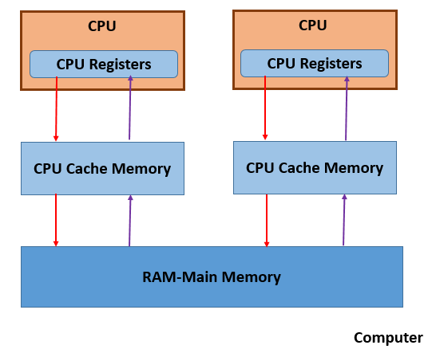
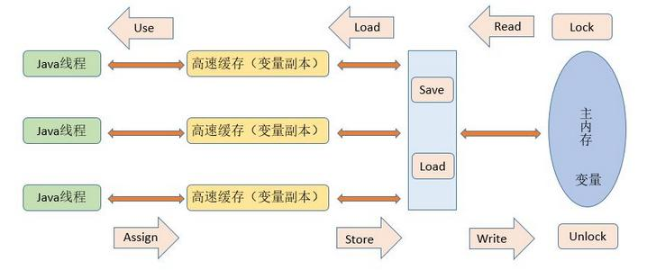
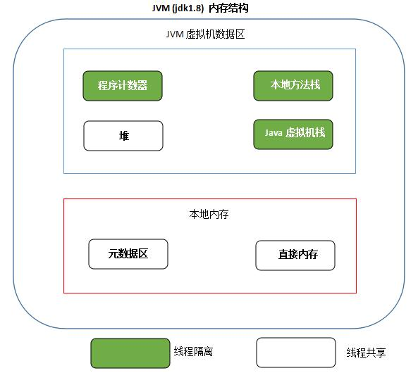

# 1. 计算机硬件架构的简单图示  
一个典型的CPU架构  

  

特点如下：
- 多个CPU  
- CPU寄存器  
- 高速缓存Cache  
- 内存  

由于计算机的存储设备与处理器的运算能力之间有几个数量级的差距，所以现代计算机系统都不得不加入一层读写速度尽可能接近处理器运算速度的高速缓存(cache)来作为内存与处理器之间的缓冲：将运算需要使用到的数据复制到缓存中，让运算能快速进行，当运算结束后再从缓存同步回内存之中，这样处理器就无需等待缓慢的内存读写了。
基于高速缓存的存储交互很好地解决了处理器与内存的速度矛盾，但是引入了一个新的问题：缓存一致性（Cache Coherence）。在多处理器系统中，每个处理器都有自己的高速缓存，而他们又共享同一主存，如下图所示：多个处理器运算任务都涉及同一块主存，需要一种协议可以保障数据的一致性，这类协议有MSI、MESI、MOSI及Dragon Protocol等。
除此之外，为了使得处理器内部的运算单元能尽可能被充分利用，处理器可能会对输入代码进行乱序执行（Out-Of-Order Execution）优化，处理器会在计算之后将对乱序执行的代码进行结果重组，保证结果准确性。与处理器的乱序执行优化类似，Java虚拟机的即时编译器中也有类似的指令重排序（Instruction Recorder）优化。

# 2. Java内存模型(Java Memory Model, JMM)
Java虚拟机规范中定义了Java内存模型(Java Memory Model，JMM),用于屏蔽掉各种硬件和操作系统的内存访问差异，以实现让Java程序在各种平台下都能达到一致的并发效果，JMM规范了Java虚拟机与计算机内存是如何协同工作的：规定了一个线程如何和何时可以看到由其他线程修改过后的共享变量的值，以及在必须时如何同步的访问共享变量.

  

Java内存模型通过图中的八种操作来完成变量从主内存加载到工作内存，然后从工作内存同步到主内存。
**Lock --> Read --> Load --> Use --> Assign --> Store --> Write --> Unlock**  
JMM 要求这个过程必须按顺序执行，但是可以不必连续执行！举个栗子：（Read A，Read B, Load B, Load A, Store B, Write B, Store A, Write A）。
此外，JMM还规定了执行上述8个操作必须满足以下规则：
- 不允许read和load、store和write操作之一单独出现  
- 不允许一个线程丢弃它的最近assign的操作，即变量在工作内存中改变了之后必须同步到主内存中  
- 不允许一个线程无原因地（没有发生过任何assign操作）把数据从工作内存同步回主内存中  
- 一个新的变量只能在主内存中诞生，不允许在工作内存中直接使用一个未被初始化（load或assign）的变量。即就是对一个变量实施use和store操作之前，必须先执行过了assign和load操作  
- 一个变量在同一时刻只允许一条线程对其进行lock操作，lock和unlock必须成对出现  
- 如果对一个变量执行lock操作，将会清空工作内存中此变量的值，在执行引擎使用这个变量前需要重新执行load或assign操作初始化变量的值  
- 如果一个变量事先没有被lock操作锁定，则不允许对它执行unlock操作；也不允许去unlock一个被其他线程锁定的变量  
- 对一个变量执行unlock操作之前，必须先把此变量同步到主内存中（执行store和write操作）  

**JMM 使用先行发生（happens-before）原则来确定一个内存访问在并发环境中是否安全**  
## 2.1 先行发生（happens-before） 概念  
一句话概括：操作A先行发生于操作B，操作A的影响会被操作B观察到  
主要包括以下情况：  
- 程序次序规则(Program Order Rule)： 在同一个线程中，按照程序代码顺序，书写在前面的操作先行发生于书写在后面的操纵。准确的说是程序的控制流顺序，考虑分支和循环等。  
- 管理锁定规则(Monitor Lock Rule)：一个unlock操作先行发生于后面（时间上的顺序）对同一个锁的lock操作。
- volatile变量规则(Volatile Variable Rule)：对一个volatile变量的写操作先行发生于后面（时间上的顺序）对该变量的读操作。  
- 线程启动规则(Thread Start Rule)：Thread对象的start()方法先行发生于此线程的每一个动作。  
- 线程终止规则(Thread Termination Rule)：线程的所有操作都先行发生于对此线程的终止检测，可以通过Thread.join()方法结束、Thread.isAlive()的返回值等手段检测到线程已经终止执行。  
- **线程中断规则(Thread Interruption Rule)：对线程interrupt()方法的调用先行发生于被中断线程的代码检测到中断时事件的发生。Thread.interrupted()可以检测是否有中断发生。**  
- 对象终结规则(Finilizer Rule)：一个对象的初始化完成（构造函数执行结束）先行发生于它的finalize()的开始。  
- 传递性(Transitivity)：如果操作A 先行发生于操作B，操作B 先行发生于操作C，那么可以得出A 先行发生于操作C。  

**敲黑板!!!**  
不同操作时间先后顺序与先行发生原则之间没有关系，二者不能相互推断，衡量并发安全问题不能受到时间顺序的干扰，一切都要以happens-before原则为准.  
**敲黑板!!!**  

## 2.2 Volatile 变量的两种特性  
- 保持变量的可见性  
- 屏蔽指令重排序  

## 2.3 long/double非原子协定  
允许虚拟机将没有被volatile修饰的64位数据的读写操作划分为2次32位操作进行  

# 3. JMM的四个特性
## 3.1 原子性  
JMM保证的原子性变量操作包括read、load、use、assign、store、write，而long、double非原子协定导致的非原子性操作基本可以忽略。  
## 3.2 可见性  
可见性是指当一个线程修改了共享变量的值，其他线程能够立即得知这个修改。JMM在变量修改后将新值同步回主内存，依赖主内存作为媒介，在变量被线程读取前从内存刷新变量新值，保证变量的可见性。普通变量和volatile变量都是如此，只不过volatile的特殊规则保证了这种可见性是立即得知的，而普通变量并不具备这种严格的可见性。除了volatile外，synchronized和final也能保证可见性。  
## 3.3 有序性  
JVM的有序性表现为：如果在本线程内观察，所有的操作都是有序的；如果在一个线程中观察另一个线程，所有的操作都是无序的。
## 3.4 重排序  
在执行程序时为了提高性能，编译器和处理器经常会对指令进行重排序。从硬件架构上来说，指令重排序是指CPU采用了允许将多条指令不按照程序规定的顺序，分开发送给各个相应电路单元处理，而不是指令任意重排。  
- 编译器优化的重排序  
- 指令级并行的重排序  
- 内存系统的重排序  


**源代码 --> 编译器优化的重排序 --> 指令级并行的重排序 --> 内存系统的重排序 --> 最终执行**


# 4. Java中的ReentrantLock  
一个线程如果已经获得一个对象的锁，那么该线程在持有锁的期间可以重复多次获得改对象的锁。Java中的synchronized块是可以被重入的。当多个线程对共享资源激烈竞争的时候，使CPU减少频繁的线程调度，是线程的执行效率更高。  
ReentrantLock有两种实现，一种是公平锁，另外一种是非公平锁。公平锁就是一个线程等待获取某个锁的时间最长，那么该线程最先获得锁。而非公平锁则不一定。

## 4.1 如何使用

	//公平锁new ReentrantLock(true),非公平锁new ReentrantLock(false)[推荐]
    Lock lock = new ReentrantLock(false);   
    lock.lock();  
    try {   
      //对共享资源的操作
    }  
    finally {  
      lock.unlock();   
    }  


## 4.2 通过代码来看如何实现  
**非公平锁:**  

static final class NonfairSync extends Sync {
        final void lock() {
        //如果CAS成功，将当前线程设置为资源的持有者
            if (compareAndSetState(0, 1))
                setExclusiveOwnerThread(Thread.currentThread());
            else
        //否则，尝试申请资源
                acquire(1);
        }

        protected final boolean tryAcquire(int acquires) {
        	//使用非公平锁的机制去获取资源
            return nonfairTryAcquire(acquires);
        }
    }

    final boolean nonfairTryAcquire(int acquires) {
            final Thread current = Thread.currentThread();
            int c = getState();
            //如果具备获取资源的条件，设置当前线程为资源的持有者，返回
            if (c == 0) {
                if (compareAndSetState(0, acquires)) {
                    setExclusiveOwnerThread(current);
                    return true;
                }
            }
            //如果发现申请资源的线程是持有该资源线程本身，则将状态加1,返回
            else if (current == getExclusiveOwnerThread()) {
                int nextc = c + acquires;
                if (nextc < 0) // overflow
                    throw new Error("Maximum lock count exceeded");
                setState(nextc);
                return true;
            }
            return false;
        }


**公平锁:**  

static final class FairSync extends Sync {
        private static final long serialVersionUID = -3000897897090466540L;

        final void lock() {
            acquire(1);
        }

        /**
         * Fair version of tryAcquire.  Don't grant access unless
         * recursive call or no waiters or is first.
         */
        protected final boolean tryAcquire(int acquires) {
            final Thread current = Thread.currentThread();
            int c = getState();
            if (c == 0) {
            	//此处多一个条件，该线程前面没有其他的线程在等待获取共享资源的锁
                if (!hasQueuedPredecessors() &&
                    compareAndSetState(0, acquires)) {
                    setExclusiveOwnerThread(current);
                    return true;
                }
            }
            else if (current == getExclusiveOwnerThread()) {
                int nextc = c + acquires;
                if (nextc < 0)
                    throw new Error("Maximum lock count exceeded");
                setState(nextc);
                return true;
            }
            return false;
        }
    }



# 5. Read / Write Locks  
ReentrantReadWriteLock是ReadWriteLock的一种实现，该类包含两个锁，一个是读锁，一个是写锁。  

public ReentrantReadWriteLock(boolean fair) {
        sync = fair ? new FairSync() : new NonfairSync();
        //读锁
        readerLock = new ReadLock(this);
        //写锁
        writerLock = new WriteLock(this);
    }

写锁的申请条件:  

/**
 * 申请写锁.
 *
 * 1.该线程申请的时刻没有其他的线程持有读锁或者写锁，申请成功后将写锁的持有数目更新为1.  
 * 2.如果该线程申请的时刻已经持有写锁，仅仅将持有的数目+1.  
 * 3.该线程申请的时刻如果有其他的线程正在持有写锁，则当前的线程将不会被线程调度器调度将会进入lies dormant状态，只至该线程获得写锁.  
 * 成功后将写锁的持有数目更新为1.
 */
public void lock() {
    sync.acquire(1);
}

读锁的申请条件:  

    /**
     * 申请读锁.
     *
     * 1.该线程申请时刻没有其他线程持有写锁。  
     * 2.该线程申请的时刻如果有其他的线程正在持有写锁，则当前的线程将不会被线程调度器调度将会进入lies dormant状态，只至该线程获得读锁.
     */
    public void lock() {
        sync.acquireShared(1);
    }

# 6. ExecutorService


ExecutorService fixedThreadPool =Executors.newFixedThreadPool(9);
	fixedThreadPool.execute(new Thread() {public void run() {
		//operation
	}});
ExecutorService singleThreadPool =Executors.newSingleThreadExecutor();
ExecutorService cachedThreadPool =Executors.newCachedThreadPool();



# 7. CountDownLatch
> 一般用于主线程执行某些指令之前，需要等待其他的几个线程全部完成.


public class Test {
	public static void main(String[] args) {
		//主线程中创建一个CountDownLatch对象,构造函数的参数表示线程的数目
		CountDownLatch countDownLatch = new CountDownLatch(5);
		for (int i = 0; i < 5; i++) {
			Thread thread = new MyThread(countDownLatch);
			thread.setName("Thread " + i);
			thread.start();
		}
		try {
			//调用await方法等待其他线程的工作全部完成
			countDownLatch.await();
		} catch (InterruptedException e) {
		}
		System.out.println("All pre Job are done.");
	}
}

class MyThread extends Thread {
	private CountDownLatch countDownLatch;
	public MyThread(CountDownLatch countDownLatch) {
		this.countDownLatch = countDownLatch;
	}
	public void run() {
		System.out.println(getName() + " is Done!");
		//使用CountDownLatch对象递减已经完成的线程数量
		countDownLatch.countDown();
	}
}


# 8. Future类的使用  
> Future 是一个接口，通过它可以获得线程执行完成之后的返回值. Future没有提供线程完成通知的机制，只能通过轮询调用isDone()方法或者调用get()方法阻塞线程来获得结果。


boolean cancel(boolean mayInterruptIfRunning);
boolean isCancelled();
boolean isDone();
V get() throws InterruptedException, ExecutionException;
V get(long timeout, TimeUnit unit)
        throws InterruptedException, ExecutionException, TimeoutException;


> Java8 提供的CompletableFuture可以弥补Future的不足,让Java拥有了完整的非阻塞编程模型.

```java
public class CompletableFuture<T> implements Future<T>, CompletionStage<T> {}
```

# 9. Java中的CAS  
CAS是compare and swap 的缩写。随着Java的发展，Java本地方法调用(JNI)的出现，使得Java程序可以越过JVM而直接调用本地方法，这为Java实现并发拓展一条新的途径。CAS理论是java concurrent包的理论基石。  

Java可以通过synchronized实现线程之间同步，但是这种方法有以下弊端:  
- 在多线程环境下，加锁和释放锁，或导致CPU比较多的上下文切换，影响性能。  
- 一个线程持有锁，会导致其他需要此锁的线程挂起。  
- 如果一个线程优先级高的去长时间等待优先级比较低的线程释放锁，也会引起性能风险。  

Synchronized就是一种独占锁或者是悲观锁，乐观锁就是每次操作都不加锁而是假设该线程没有和其他线程冲突，如果有冲突失败就重试，直到成功为止，通过CAS可以实现乐观锁。  

CAS包含三个操作数:内存位置(V), 预期原值(A)和新值(B)。如果内存位置的当前值与预期原值一样，那么处理器就会将新值更新内存位置(V)的值。否则，不做任何操作，只需要告诉我内存位置(V)的值就好了。无论哪种情况，它都会在 CAS指令之前返回该位置的值。

# 10. JVM内存模型 (jdk1.8)

 

- 程序计数器  
每个JVM线程都有独自的程序计数器，JVM线程正在Running的方法称为current method.如果该方法不是一个native方法，程序计数器指向正在执行的语句的地址，如果该方法是一个本地方法，那么程序计数器的值是undefined.  
- Java虚拟机栈  
每个JVM线程都有独自的Java虚拟机栈，随着线程的创建而创建。保存本地变量的值和方法的部分返回值，作为方法调用和return的一部分。一般情况下不会对Java虚拟机栈直接操作，除了对帧进行pop和push操作，因此这块内存一般不是连续的。 
- 堆  
堆被Java虚拟机中的所有线程共享，是运行时的数据区，存放类的实例，以及存放数组数据。堆上的数据被垃圾回收器回收清理。堆的大小可以是固定的或者可以被扩展。如果程序在运行过程中所需的堆的大小超出可提供的对大小，将会抛出OOM异常。  
- 本地方法区  
Java虚拟机可以调用本地方法的一种实现。这些本地方法可能通过其他的语言实现，比如C，C++.本地方法栈也用来实现一些用C语言实现的JVM指令。本地方法栈的大小可以是固定的，也可以被动态扩展。
- 帧  
帧被分配在每个JVM线程运行时的Java虚拟机栈上。随着方法被调用而创建，用来存放方法的本地变量，部分的返回结果，执行动态链接，或者分发异常。每一个帧都拥有自己的本地变量数组，操作栈，以及一个当前方法的引用，这个引用指向运行时的常量池。程序编译时决定为该方法分配的帧大小。帧只能被创建它的线程使用。不能被其他线程共享。
- 元数据区  
jdk1.8之前使用PermGen存放类的元数据信息，在jdk1.8中用元数据区存放类的元数据信息。元数据区是属于系统内存的一部分，可以最大可利用空间是整个系统内存的可用空间。  
    - -XX:MetaspaceSize 元数据区的初始空间大小  
    - -XX：MaxMetaspaceSize 元数据区最大空间大小  
    - -XX：MinMetaspaceFreeRatio 在GC之后，最小的Metaspace剩余空间容量的百分比，减少为class metadata分配空间导致的垃圾收集  
    - -XX:MaxMetaspaceFreeRatio,在GC之后，最大的Metaspace剩余空间容量的百分比，减少为class metadata释放空间导致的垃圾收集  


### 引用  
- [参考链接1](https://blog.csdn.net/u011080472/article/details/51337422)
- [参考链接2](http://tutorials.jenkov.com/java-concurrency/java-memory-model.html)
- [参考链接3](https://blog.csdn.net/fw0124/article/details/6672522)
- [参考链接4](http://tutorials.jenkov.com/java-concurrency/reentrance-lockout.html)  
- [参考链接5](https://blog.csdn.net/ls5718/article/details/52563959)  
- [Java Virtual Machine Specification](https://docs.oracle.com/javase/specs/jvms/se8/html/jvms-2.html#jvms-2.5.1)  


