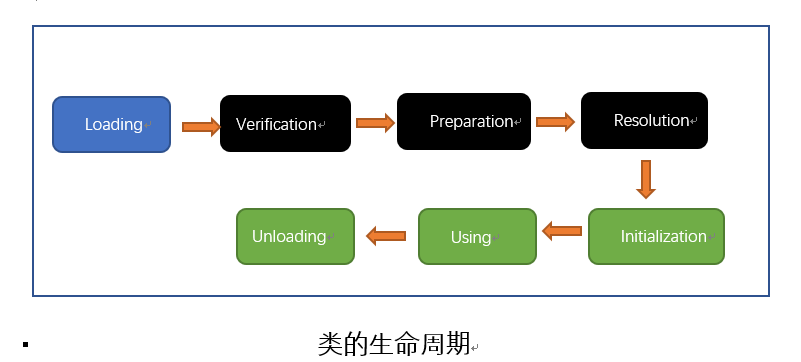

# Understanding JVM - version 2


## Chapter2 Java内存区域与内存溢出异常

### 2.1 对象的创建

1\. 当虚拟机遇到一条new指令时，首先检查这个指令的参数是否能在常量池中定位到一个类符号的引用，并检查这个类是否被加载，解析，初始化。如果没有，必须先执行类的加载。

2\. 当类加载检查通过后，虚拟机为新的对象分配内存。对象所需要的内存大小在类加载完成之后便可以确定。

3\. 内存分配完成之后，将分配的内存初始化零值，除了对象头的部分。

4\. 虚拟机设置对象，标记这个对象是哪个类的实例，如何找到类的元数据信息，对象的hashcode，对象的GC年龄等信息。

### 2.2 对象在内存中的结构

- 对象头(Header): 包含HashCode，GC分代年龄，锁状态标志，线程持有的锁，偏向线程ID，偏向时间戳，类型指针（指向类元数据的指针）。

- 实例数据(Instance data)

- 对齐填充(Padding)


> String.intern() 

该方法是一个native方法。它的作用是：如果字符串常量池中已经包含一个等于此String对象的字符串，则返回代表池中这个字符串的String对象；否则，将此String对象包含的字符串添加到字符串常量池中，并且返回此String对象的引用。

### 2.3 对象的访问方式

Java程序需要通过栈上的reference数据来操作对上的具体对象。

- 句柄：在Java的对上化分一块内存作为句柄池，reference中存储的就是对象的句柄地址，句柄中包含了对象的实例数据与类型数据各自的具体地址信息。优点是在对象被移动的时候只会改变句柄中的实例数据的指针，reference本身不需要要修改。

- 指针：reference中存储的就是对象的地址。优点是访问速度快。

## Chapter3 垃圾收集器与内存分配策略

### 3.1 判断对象已死的算法

名称|优点|缺点
---|---|---
引用计数算法|实现简单，效率高|无法解决对象之间相互循环引用的问题
可达性分析算法(GC Roots)||

### 3.2 引用的类型

- 强引用 垃圾回收器永远不会回收被强引用的对象

- 软引用 在系统内存不够用的时候，会把这部分对象列入第二次垃圾回收的对象，如果第二次回收内存还不够，则OOM。

- 弱引用 弱引用的对象只能存活到下次垃圾回收之前。无论内存是否够用，下次垃圾回收一定会回收这部分对象。

- 虚引用 为对象设置虚引用的目的就是能在这个对象被回收器回收时收到一个通知。

> 对象的finalize()只会被系统自动调用一次。


### 3.3 垃圾收集算法

- 标记-清除算法

缺点：效率低，内存碎片化严重

- 复制算法 将内存分为两部分，先用一部分。需要回收的时候将存活的对象复制到另一部分。

- 标记整理算法

- 分代收集算法 
对新生代使用复制算法，对老年代使用标记整理算法

### 3.4 垃圾回收器的实现

- Serial收集器  Stop the Wolrd，简单高效

- ParNew收集器 Serial收集器的多线程版本

- Parallel Scavenge收集器 是一个新生代收集器，复制收集器，并行多线程收集器，主要关注的CPU的吞吐量。-XX:MaXGCPauseMillis控制最大垃圾收集停顿时间 -XXMaxGCTimeRatio直接设置吞吐量大小。 吞吐量=CPU运行客户代码的时间/CPU运行客户代码的时间+垃圾回收时间

- CMS收集器 以获取最短停顿时间，并发收集，低停顿

- G1收集器 并行并发，分代收集，标记整理清除，可预测停顿

### 3.5 内存分配与回收策略

- 新生代在Eden上分配
- 大对象直接进去老生代
- 长久存活的对象直接进入老年代

## Chapter4 虚拟机性能监控与故障处理工具 p124

## Chapter5 调优案例分析与实践 p155

## Chapter6 类文件结构 p185 

### 6.1 Magic Number 与Class文件的版本

> Class文件的前4个字节成为魔数，唯一作用是用来确定这个文件是否能被虚拟机接受的Class文件。

第5个字节和第6个字节代表版本号

### 6.2 常量池

常量池中的每一个常量都对应一张表。

- 类和接口的Fully Qualified Name
- 字段的名称和描述符
- 方法的名称和限定符

Class文件不保存方法，字段的最终内存布局信息，因此这些字段，方法的符号引用不经过运行期转换无法获得真正的内存地址。因此，当虚拟机运行时，需要先从常量池获得对应的符号引用，在类创建或运行时解析，翻译到具体的内存地址。

> JDK/bin ```javap -berbose xxx.class```

### 6.3 访问标志 access_flag

标志一个Class是类还是接口，是public or private，final?

### 6.4 类索引，父类索引与接口索引集合

- 类索引确定类的全限定名
- 父类索引确定父类的全限定名
- 接口索引集合确定这个类实现了那些接口

### 6.5 字段表集合 field_info

用来描述接口或者类中声明的变量。

### 6.6 方法表集合

方法的特征签名不包括返回值类型。所以在Java中重载一个方法的时候除了方法名要一致，还要保证方法的参数不一样！

### 6.7 属性表集合

> Code属性
Java程序方法体中的代码经过Javac编译器处理后，最终变为字节码指定存储在Code属性内。

### 6.8 同步指令

Java虚拟机支持方法级别的同步和代码块的同步。

- 方法级的同步通过从方法常量池的方法表结构中的ACC_SYNCHRONIZED访问标志得知一个方法是否为同步方法。
- 同步代码块是通过synchronized语句块实现的，Java虚拟机的指令集中有monitorenter和monitorexit两条指令。


## Chapter7 虚拟机类加载机制 p232

类在JVM中的生命周期：加载(Loading)，验证(Verification)，准备(Preparation)，解析(Resolution)，初始化(Initalization)，使用(Using)，卸载(Unloading)7个阶段。
 

### 7.2 类加载的时机

类必须初始化的的5中情况：

- 遇到new, getstatic, putstatic, 或者invokestatic这4条字节码指令时，如果类没有初始化，则必须初始化。

- 使用java.lang.reflect包的方法对类进行反射调用的时候。

- 当初始化一个类的时候，如果发现父类没有初始化，则立即初始化父类。一个接口在初始化的时候，并不要求其父接口全部都完成了初始化，只有在真正使用到父接口的时候才初始化。

- 当虚拟机启动时，用户指定main()方法所在的类

- 当使用JDK1.7的动态语言支持时，如果一个java.lang.invoke.MethodHandle实例最后的解析结果是REF_getstatic,REF_putstatic,REF_invokestatic的方法句柄，并且这个句柄所对应的类没有进行过初始化。

### 7.3 类加载的过程
>  加载的过程需要完成3件事情

- 同过一个类的全限定名获取此定义此类的二进制字节流。

- 将这个字节流所代表的静态存储结构转化为方法区的运行时数据结构。

- 在内存中生成一个代表这个类的java.lang.Class对象。

数组不通过类加载器创建，数组是由JVM直接创建。

> 验证

- 文件格式验证

- 元数据验证

- 字节码验证

- 符号引用验证

对于虚拟机的类加载机制来说，验证阶段是一个非常重要的但不是一定必要的阶段。 可以通过-Xverify:none参数来关闭大部分的类验证措施，以缩短JVM加载类的时间。

> 准备

准备阶段是正式为类变量分配内存并设置类变量初始值的阶段，这些变量所使用的内存都将在方法区进行分配。这个时候进行内存分配的仅包括被static修饰的变量，而不包括实例变量，实例变量将会在对象实例化时随着对象一起分配在java的堆中。

> 解析

解析阶段是虚拟机将常量池内的符号引用替换为直接引用的过程。

- 符号引用：符号引用以一组符号来描述所引用的目标，符号引用的字面量形式明确定义在java虚拟机规范的Class文件格式中。符号引用与虚拟机实现的内存布局无关，引用的目标并不一定加载到内存中。

- 直接引用：直接引用可以是直接指向目标的指针，相对偏移量或是一个间接定位到目标的句柄。与虚拟机实现的内存布局有关。


> 初始化

开始执行类中定义的Java代码。初始化阶段是执行类构造器<clinit>()方法的过程。
- ```<clinit>()```方法是由编译器自动收集类中的所有类变量的赋值语句和静态语句块中的语句合并产生的。
- 静态语句块中只能访问到定义在静态语句块之前的变量，定义在它之后的变量，在静态语句块之前可以赋值，但是不能访问。


### 7.4 类加载器

比较两个类是否“相等”，只有这两个类是由同一个类加载器的前提下才有意义！对于任意一个类，都需要由加载它的类加载器和这个类本身一同确立其在java虚拟机中的唯一性。

> 双亲委派模型 p252

- 启动类加载器：负责将<JAVA_HOME>/lib 目录中的类或者被 -Xbootclasspath参数所指定的的类库加载到虚拟机的内存中。启动类加载器无法被Java程序调用。

- 扩展类加载器：负责将<JAVA_HOME>/lib/ext目录或者被java.ext.dirs系统变量所指定的路径中所有的类库。开发者可以使用扩展类加载器。

- 应用程序类加载器： 负责加载用户路径上所指定的类库，默认的类加载器。

双亲委派模型的加载过程：如果一个类加载器收到了类加载的申请，它首先不会自己去尝试加载这个类，而是把这类请求委派给父类的加载器去加载。每一个层次的类加载都是如此。因此所有的类加载的请求最终都会传到顶层的启动类加载器，只有当父类加载器无法反正类加载请求，子加载器才会尝试去加载。

破坏双亲委派模型：线程上下文类加载器。


## Chapter8 虚拟机字节码执行引擎 p259

## Chapter9 类加载及执行子系统的案例与实践 p299

## Chapter10 编译器优化 p325

## Chapter11 运行期优化 p352

## Chapter12 Java内存模型与线程 p383 //TODO

## Chapter13 线程安全与锁优化 p408   //TODO


