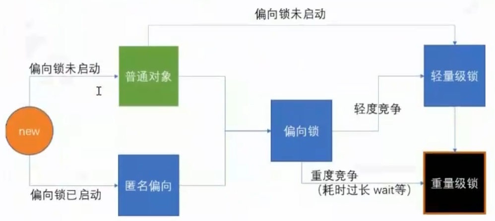
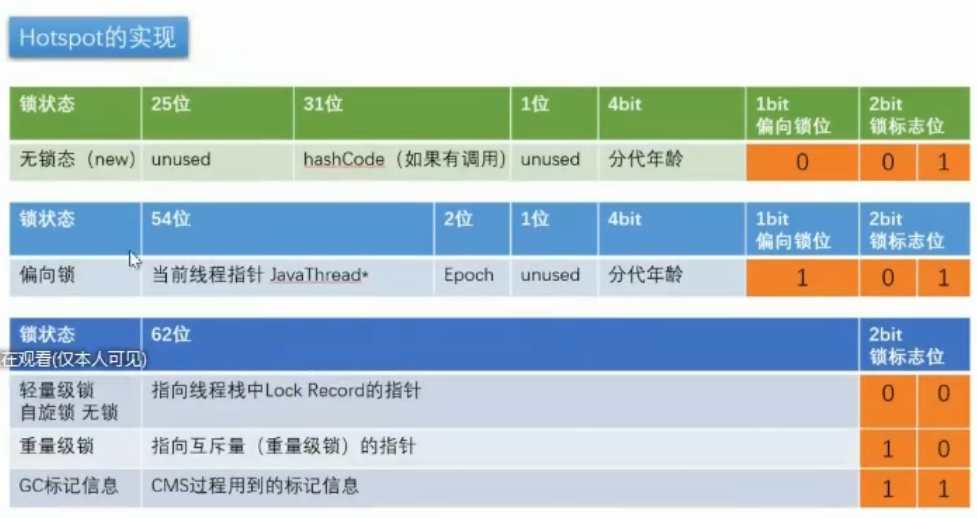

# 2021-Kickoff

## Common

```transient``` The transient keyword in Java is used to avoid serialization.

## Spring
https://processon.com/signup?f=index

### Spring程序是如何启动的？

- Tomcat容器是什么时候启动的？

```
SpringBootServletInitializer.onStartup() -> createRootApplicationContext()
```


核心： DispatcherServlet
```
public class MyWebApplicationInitializer implements WebApplicationInitializer {

    @Override
    public void onStartup(ServletContext servletContext) {

        // Load Spring web application configuration
        AnnotationConfigWebApplicationContext context = new AnnotationConfigWebApplicationContext();
        context.register(AppConfig.class);

        // Create and register the DispatcherServlet
        DispatcherServlet servlet = new DispatcherServlet(context);
        ServletRegistration.Dynamic registration = servletContext.addServlet("app", servlet);
        registration.setLoadOnStartup(1);
        registration.addMapping("/app/*");
    }
}
```

### Spring是如何加载配置文件到应用程序的？
### BeanDefinitionReader

XMLBeanDefinitionReader  - 负责加载基于XMl的bean
ClassPathBeanDefinitionScanner - 负责加载基于注解的bean


### BeanFactory
### 彻底搞定Spring的refresh方法
### BeanPostProcessor接口
```
BeanFactoryPostProcessor --> BeanDefinitionRegistryPostProcessor ->  
ConfigurationClassPostProcessor --> ConfigurationClassParser.doProcessConfigurationClass

分以下情况：
@Configuration (@Component)
@ComponentScan
@PropertySource
@Import
@ImportResource
@Bean

```


### BeanFactoryPostProcessor接口
### SpringBean有没有必要实现Aware接口
### 彻底理解SpringBean的生命周期
### 循环依赖问题
### FactoryBean接口的作用
### Bean的初始化都经历什么
### cglib和jdk动态代理

### Aop如何处理的
```
@ControllerAdvice

MethodInterceptor  CglibMethodInvocation-> (advice method chain)

@Transaction TransactionAspectSupport


//Sample

@Aspect
@Component
public class AspectJLogUtil {
  
  @Pointcut("execution(public com.sample.MyService.AddUser)")
  public void logPoint(){}


  @Around("logPoint()")
  @Order(4)
  //连接点 advice和PointCut组合在一起，形成一个Join point
  public Object around(ProceedingJoinPoint proceedingJoinPoint ) {
    //TODO
    return new Object();
  }
}
```


## JVM Tunning

```
java -XX:+PringFlagsFinal

java -Xms200M -Xmx200M -XX:+PrintGC 
```
http://www.oracle.com/technetwork/java/javase/documentation/index.html 


> Garbage Collectors

```
<Serial, SerialOld>, <ParNew, CMS>, <Parallel Scavenge, Parallel Old> - G1

jdk1.8使用G1没有问题

```


> JVM tuning tool
- alibaba arthas
- JConsole
- JProfile


```
jps

top -Hp <processID>
jmap histo <ThreadID> | head -20
trace ABC a

#hot load class
redefine 

```

## CAS

最底层是一条汇编指令```lock cmpxchg```

### AQS？

## JUC

  


3. 默认synchronized(o)

00->轻量级锁，默认情况下偏向锁的开启有个4秒延时，因为JVM虚拟机本身有一些默认启动的线程，这些线程之间肯定会有竞争，如果上来就是用偏向锁，就会不断的造成锁撤销，锁升级，效率变低。

```
-XX:BiasedLockingStartupDelay=0
```

4. 如果设定上述参数

```new Object``` -> 101 偏向锁 -> 线程ID为0 -> Anonymous BiasedLock 打开偏向锁，new 出来的对象，默认就是一个可偏匿名对象101

5. 如果线程上有锁

上偏向锁，指的就是，把markword的线程ID改为自己线程ID的过程，偏向锁不可重偏向，批量偏向，批量撤销

6. 如果有线程竞争

撤销偏向锁，升级轻量级锁，线程在自己的线程栈生成LockRecord, 用CAS操作将markword设置为指向自己这个线程的LR的指针，设置成功者获得锁

7. 如果竞争加剧

情况1：有线程超过10次自旋，```-XX:PreBloackSpin```, 后者自旋的线程数超过CPU核数的一半，1.6之后，加入自适应自旋Adapative Self Spining，JVM自己控制
情况2： 升级重量级锁，向操作系统申请资源，线程挂起，进入等待队列，等待操作系统的调度

> 轻量级锁重量级锁的hashcode存在什么地方？

答案：线程栈中，轻量级锁的LR种，或者代表重量级锁的ObjectMonitor的成员中

> 为什么有自旋锁还需要重量级锁

答案： 自旋锁是消耗CPU资源的，如果线程执行时间比较长，而同时等待的线程比较多，CPU会被大量消耗在等待上，重量级锁如果获取不到，就进入到等待队列中，不会消耗CPU

> 偏向锁一定比自旋锁效率高么？

答案：不一定。在明知道会有多线程竞争的情况下，偏向锁会涉及锁撤销，升级为轻量级锁。

### 算法

- 快速排序，j表示从右边开始的游标，j最后锁听的位置就是从右边数最后一个比base小的数，也就是需要和base交换的位置。

#### 红黑树

- 树上的节点都有颜色，或是红，或者是黑, 根节点一定是黑色
- 所有的叶子节点都是黑色
- 若一个节点的颜色是红色，那么其孩子节点都是黑色
- 从一个结点出发到其后代节点的所有路径，都包含相同数量的黑色节点

对红黑书的操作：

1. 染色
2. 左旋：以节点X左旋就是把该节点的右节点，变为其父节点。右节点的左孩子节点变为节点X的右孩子节点
3. 右旋：以节点X右旋就是把该节点的左节点，变为其父节点，左节点的右孩子节点变为节点X的左孩子节点


#### 双向链表

- 删除操作

```
           Remove
P|0|N  <-> P|1|N <-> P|2|N
           NodeX

Node pre = NodeX.pre
Node next = NodeX.next

pre.next = next;
NodeX.pre = null

next.pre = pre;
NodeX.next = null;

```

- 添加操作,默认添加到结尾

```
P|last|N   <-> P|New|N

Node l = last;
Node newNode = new Node(l, e, null);
last = newNode;

if (l==null) {
  first = newNode;
} else {
  l.next = newNode;
}


```

#### 图

- 图的广度优先遍历算法

1. 从图中选取任一节点作为初始节点访问，标记其被访问
2. 依次访问该节点的相邻节点，标记被访问，放入队列
3. 从队列中依次取出邻接点，一一遍历，直到图中所有已被访问过的顶点的邻接点都被访问。


### 分布式

- TCP
- dubbo
- http


框架|协议|优缺点
---|---|---
websocket |  tcp http soap |
dubbo   |   tcp  dubbo | 交换的数据放在数组中，空间使用率很高
springcloud |tcp http | json格式


客户端调用服务所考虑的维度 

1. 区域/机房感知
2. 负载均衡
  - 轮询算法
  - 随机算法
  - 源地址哈希
  - 加权轮询
  - 最小链接数
  - 定向分发
  - 区域权衡策略
  - 可用过滤策略
  - 响应时间加权策略


缓存数据 --> 定向流量分发

SpringCloud 配置文件， 不重启需改配置 @RefreshScope， 一般使用配置中心
SpringCloud Config 配置中心 -> 溯源/审计 --> Git/SVN  通过BUS（消息总线）广播消息

Alibaba Nacos消息中间件/携程 apllo

SPI？


服务降级/  服务黑名单  hystrix (代码侵入性强)  Sentinel替换Hystrix

熔断三个功能 
1.熔断，
2.服务降级，
3.资源隔离（服务的调用方）
  - 线程池隔离
  - 信号量隔离(计数器)

CAP Consistency/Availability/Partition Tolerance


关于服务注册中心：想要高一致性，就做集群，想要高性能，就不要集群

注册中心可以以服务化分，同一类服务注册到一个服务注册中心
```
分布式一致性算法—Paxos
- raft
- zab 

```


SpringCloud Alibaba
产品1|产品2|优缺点
---|---|---
Sentinel|Hystrix| Hystrix基于线程池做资源隔离，Sentinel主要支持以QPS为单位的限流
Nacos|SpringCloudConfig、Eureka|
RocketMQ|Kafaka|不需要写代码，支持顺序消息，事务消息，Dashboard
Dubbo|Open feign| springCloud 基于http，Dubbo基于dubbo，不能直接替换
Seata|| 分布式事务


#### Sentinel
滑动事件窗口
实现思路：一共有120个容器，写入每500ms的请求量，然后计算每两个容器中请求数量的和。


> 一个服务好好的，突然变得响应延迟，有哪些原因？

1. 网络阻塞
2. CPU计算能力不足
3. 频繁GC（对象生命周期问题）

> QPS - RT(相应延迟)

一秒之内接受请求的数量。

#### 消息中间件

名称|适合的场景|特点
---|---|---
Kafka||
Apache ActiveMQ||
gRPC||
RabbitMQ||


### NIO

```
# $$代表当前进程ID号，fd代表文件描述符
cd /proc/$$/fd
pwd
exec 8<> /dev/tcp/www.baidu.com/80
# /代表请求的根目录， 重定向是文件描述符必须加&
echo -e "GET / HTTP/1.0\n" >& 8
#标准输入0的内容来自 8号文件描述符
cat 0<& 8

#关掉文件描述符
exec 8<& -

```


> tcpdump
使用抓包工具看流量到底走的是那个网卡

```

tcpdump -nn -i eth0 port 80


netstat -natp

#查看路由表
route -n 

#查看链路表
arp -an

arp -a 


#1. 打开监听
tcpdump -nn -i eth0 arp or port 80

#2. 查看arp和tcp握手的过程
arp -d <ip> && curl www.baidu.com

```


#### Netty


- 问题1： 聊聊select()函数

答案：select 函数在监听socket数量的时候有限制，默认最大数是1024，因为其内部是通过一个fd_set, bitmap来存放socket的fd引用的。bitmap的长度默认值就是1024。监听到有就绪的socket fd的时候，就会做个标记，然后返回给调用者有多少个socket fd处于就绪状态。然后再做一个System call,去检查fd_set集合中每一个socket的状态。每次系统调用都要涉及内核态与用户态的切换，并且涉及到参数的copy，如果数量比较大，那么就会影响性能。socket里面有三块区域，读缓存，写缓存，还有等待队列。

- 问题2： 聊聊poll()函数

答案：poll解决上select传参的问题，poll使用数组，没有1024的限制。

- 问题3： 聊聊epoll()函数

答案：select和poll函数都需要用户传递给其需要监听的socket fd列表，并且是有一个线程一直的再监听socket fd的状态，比较消耗CPU性能。在实际的应用场景中，我们监听的socket集合，数据变化并不大，但是在调用的时候需要把整个需要监听的socket fd列表回传，数据无意义copy开销大，并且这两个函数返回值都是int，只能代表有几个socket就绪或者发生了错误， 并不返回具体就绪的socket fd列表，这样就导致程序还需要新一轮的system call去检查具体就绪的socket fd。

epoll的方案，在内核空间创建eventpoll对象，通过epoll_create（）创建返回epfd，epoll_ctl()去管理. EventPoll主要包含两块区域，一块是需要监听的socketfd，另外一块是：就绪列表, 采用红黑树的结构存储，O(logN)。epoll_wait(epfdid), 


### 规划学习

jdk-juc 源码，SpringIOC+AOP源码，Jvm理论知识，jmm理论知识  


