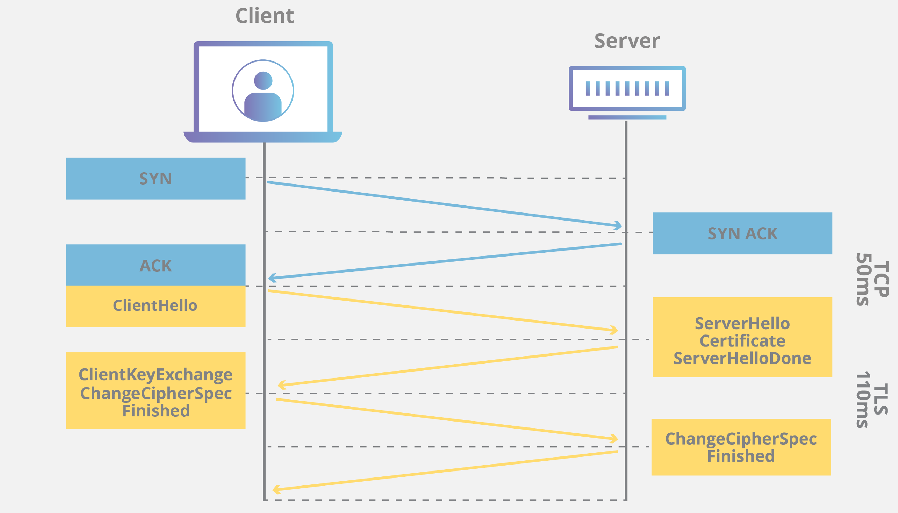

# Http vs Https

## Http protocol 

Type| Desc
--- | ---
URG: | Urgent Pointer field significant
ACK: | Acknowledgment field significant
PSH: | Push Function
RST: | Reset the connection
SYN: | Synchronize sequence numbers
FIN: | No more data from sender

### Requires three packets to be transmitted when starting a TCP connection

### Requires four packets to be transmitted when ending a TCP connection

## Https protocol

TLS 握手是由客户端和服务器交换的一系列数据报或消息。TLS 握手涉及多个步骤，因为客户端和服务器要交换完成握手和进行进一步对话所需的信息。

TLS 握手的确切步骤将根据所使用的密钥交换算法的类型以及双方支持的密码套件而有所不同。RSA 密钥交换算法最为常用。具体如下：

1. **“客户端问候（client hello）” 消息**： 客户端通过向服务器发送“问候”消息来开始握手。该消息将包含客户端支持的 TLS 版本，支持的密码套件，以及称为一串称为“客户端随机数（client random）”的随机字节。
2. **“服务器问候（server hello）”消息：** 作为对 client hello 消息的回复，服务器发送一条消息，内含服务器的 SSL 证书、服务器选择的密码套件，以及“服务器随机数（server random）”，即由服务器生成的另一串随机字节。
3. **身份验证：** 客户端使用颁发该证书的证书颁发机构验证服务器的 SSL 证书。此举确认服务器是其声称的身份，且客户端正在与该域的实际所有者进行交互。
4. **预主密钥：** 客户端再发送一串随机字节，即“预主密钥（premaster secret）”。预主密钥是使用公钥加密的，只能使用服务器的私钥解密。（客户端从服务器的 SSL 证书中获得公钥。）
5. **私钥被使用：** 服务器对预主密钥进行解密。
6. **生成会话密钥：** 客户端和服务器均使用客户端随机数、服务器随机数和预主密钥生成会话密钥。双方应得到相同的结果。
7. **客户端就绪：** 客户端发送一条“已完成”消息，该消息用会话密钥加密。
8. **服务器就绪：** 服务器发送一条“已完成”消息，该消息用会话密钥加密。
9. **实现安全对称加密：** 已完成握手，并使用会话密钥继续进行通信。

### references
- https://docs.microsoft.com/en-us/troubleshoot/windows-server/networking/three-way-handshake-via-tcpip
- https://howhttps.works/the-handshake/
- https://www.cloudflare.com/zh-cn/learning/ssl/what-happens-in-a-tls-handshake/