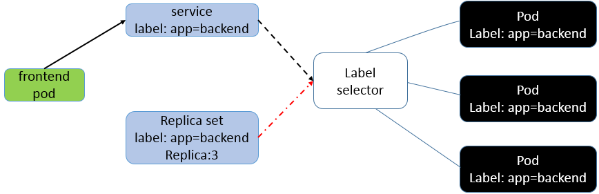

# Kubernetes Volume
Volume 是Pod中能够被多个容器访问的共享目录。
- Kubernetes的Volume定义在Pod上，被Pod中的多个容器挂载到具体的文件目录下。
- Kubernete Volume的生命周期与Pod相同。与容器无关，也就是说容器停止或者重启，Volume中的数据不会丢失。

- Kubernetes支持多种类型的Volume，例如:ClusterFS,Ceph等分布式文件系统。

## Persistent Volume
- NFS, AWS, GlusterFS, GCE persistent Disks, RBD

# Kubernetes Service

- Kubernetes的service定义了一个服务的访问地址，前端的应用Pod通过这个入口访问地址访问背后的一组由Pod副本组成的服务集群，Service与其后端的Pod副本集群之间通过Label Selector关联在一起。RC的作用是保证service的服务能力与服务质量达到预期的标准。kube-proxy将对service的请求负载均衡到后端的pod上。kube-proxy提供内部的负载均衡能力。  

- Service 一旦创建，Kubernete会为它创建一个全局唯一的虚拟IP，即ClusterIP。
- spec.ports中**port**指定Service的虚拟端口号，**targetPort**指定容器向外界提供服务所EXPOSE的端口号，如果不指定，表示和port的值一样。**nodePort**和*type: NodePort*一起使用，将服务提供给Kubernete集群外部的应用使用。

```docker
...
spec:
  type: NodePort
  ports:
  - port: 8080
    targetPort: 8080
    nodePort: 10086
```


## Types of IP

- NodeIP: Node节点的IP
- Pod IP：POD的IP
- Cluster IP： Service的IP。仅仅作用于Kubernetes Service这个对象，由Kubernetes管理和分配。无法被ping。只能与Service Port组合起来使用。


