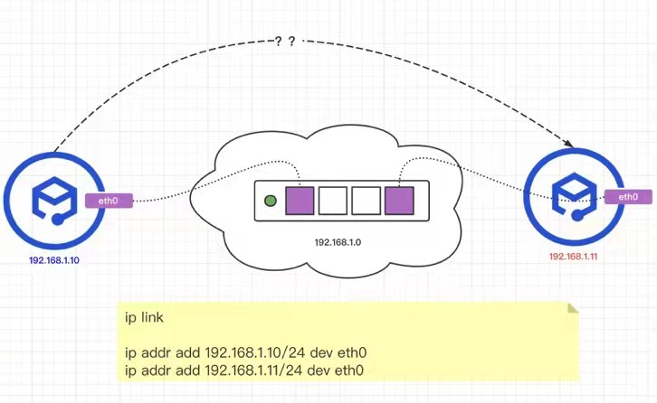
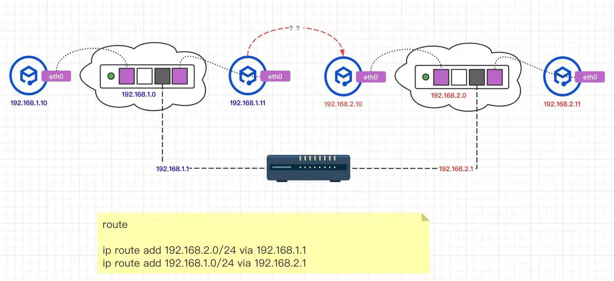
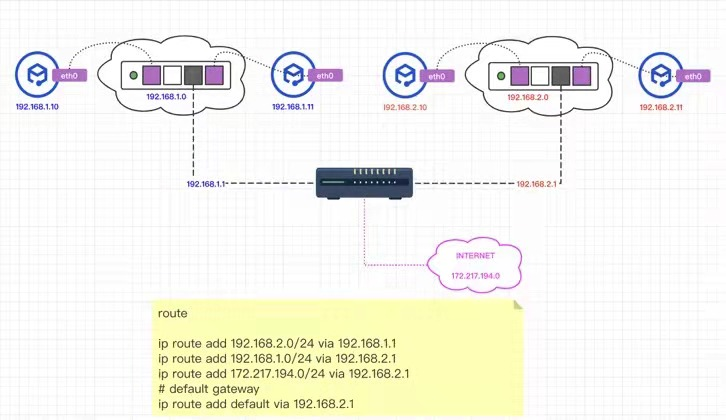
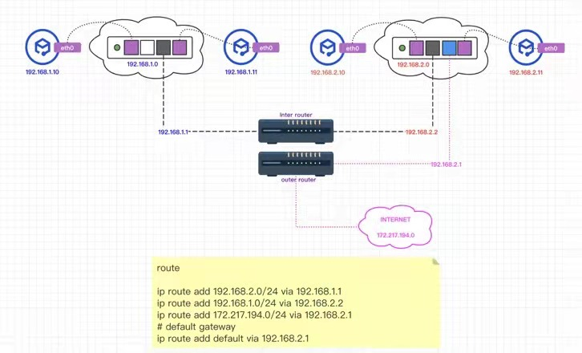

# Kubernetes Memo

## Kubernetes Terminology

Term | Definition
--- | ---
Node | A server that hosts applications in a Kubernetes cluster.
Master Node | A node server that manages the control plane in a Kubernetes cluster. Master nodes provide basic cluster services such as APIs or controllers.
Worker Node | Also named Compute Node, worker nodes execute workloads for the cluster. Application pods are scheduled onto worker nodes.
Resource| Resources are any kind of component definition managed by Kubernetes. Resources contain the configuration of the managed component (for example, the role assigned to a node), and the current state of the component (for example, if the node is available).
Controller | A controller is a Kubernetes process that watches resources and makes changes attempting to move the current state towards the desired state.
Label | A key-value pair that can be assigned to any Kubernetes resource. Selectors use labels to filter eligible resources for scheduling and other operations.
Namespace | A scope for Kubernetes resources and processes, so that resources with the same name can be used in different boundaries.

## Switching

## Routing

## Gateway

## Using Secrets as environment variables

https://kubernetes.io/docs/concepts/configuration/secret/

## init-containers

https://kubernetes.io/docs/concepts/workloads/pods/init-containers/#examples

