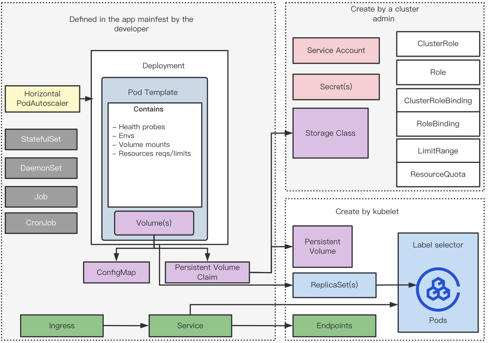

# k8s basic concepts

## What is Cloud Native


### Pivotal definition

- The Twelve-Factor App: A collection of cloud-native app architecture patterns
- Microservices: Independently deployable services that do one thing well
- Self-Service Agile Infrastructure: Platforms for rapid, repeatable, and consistent provisioning of app environments and backing services
- API-based Collaboration: Published and versioned APIs that allow interaction between services in a cloud-native app architecture
- Anti-Fragility: Systems that get stronger when subjected to stress

### 2015 CNCF definition

- Container-packaged
- Dynamically scheduled
- Micro services-oriented

### 2018 CNCF re-definition

- Cloud native technologies empower organizations to build and run scalable applications in modern, dynamic environments such as public, private, and hybrid clouds. Containers, service meshes, microservices, immutable infrastructure, and declarative APIs exemplify this approach.

## What is Kubernetes

> Kubernetes, also known as K8s, is an open-source system for automating deployment, scaling, and management of containerized applications.

It groups containers that make up an application into logical units for easy management and discovery. Kubernetes builds upon 15 years of experience of running production workloads at Google, combined with best-of-breed ideas and practices from the community.

## Kubernetes cluster 


### Kube-apiserver

The Kubernetes API is the front end of the Kubernetes control plane, handling internal and external requests. The API server determines if a request is valid and, if it is, processes it. You can access the API through REST calls, through the kubectl command-line interface, or through other command-line tools such as kubeadm.

### Kube-scheduler

The scheduler considers the resource needs of a pod, such as CPU or memory, along with the health of the cluster. Then it schedules the pod to an appropriate compute node.

### Kube-controller-manager

Controllers take care of actually running the cluster, and the Kubernetes controller-manager contains several controller functions in one. One controller consults the scheduler and makes sure the correct number of pods is running. If a pod goes down, another controller notices and responds. A controller connects services to pods, so requests go to the right endpoints. And there are controllers for creating accounts and API access tokens.

### etcd

Configuration data and information about the state of the cluster lives in etcd, a key-value store database. Fault-tolerant and distributed, etcd is designed to be the ultimate source of truth about your cluster.

### Nodes

Pods are scheduled and orchestrated to run on nodes.

### Pods

A pod is the smallest and simplest unit in the Kubernetes object model. It represents a single instance of an application. Each pod is made up of a container or a series of tightly coupled containers, along with options that govern how the containers are run. Pods can be connected to persistent storage in order to run stateful applications.

### kubelet

Each compute node contains a kubelet, a tiny application that communicates with the control plane. The kublet makes sure containers are running in a pod. When the control plane needs something to happen in a node, the kubelet executes the action.

### kube-proxy

Each compute node also contains kube-proxy, a network proxy for facilitating Kubernetes networking services. The kube-proxy handles network communications inside or outside of your cluster—relying either on your operating system’s packet filtering layer, or forwarding the traffic itself.

### Persistent storage

Beyond just managing the containers that run an application, Kubernetes can also manage the application data attached to a cluster. Kubernetes allows users to request storage resources without having to know the details of the underlying storage infrastructure. Persistent volumes are specific to a cluster, rather than a pod, and thus can outlive the life of a pod.

### Container registry

The container images that Kubernetes relies on are stored in a container registry. This can be a registry you configure, or a third party registry.


### Underlying infrastructure

Where you run Kubernetes is up to you. This can be bare metal servers, virtual machines, public cloud providers, private clouds, and hybrid cloud environments. One of Kubernetes’s key advantages is it works on many different kinds of infrastructure.

### Built in workloads



## Scheduling

1\. by nodeName

```yaml
apiVersion: v1
kind: Pod
metadata:
  labels:
    run: nginx
  name: nginx
spec:
  containers:
  - image: nginx
    name: nginx
  nodeName: node01
```

2\. by binding api

```yaml
apiVersion: v1
kind: Binding
metadata:
  name:nginx
target:
  apiVersion: v1
  kind: Node
  name: node01
```

```shell
curl --header "Content-type:application/yaml" -X POST https://<API_SERVER_HOST>:8443/api/v1/namespaces/default/pods/$PODNAME/binding/ --data 
'
apiVersion: v1
kind: Binding
metadata:
  name:nginx
target:
  apiVersion: v1
  kind: Node
  name: node01
'
```

3\. by labels and selectors

```yaml
apiVersion: apps/v1
kind: ReplicaSet
metadata:
  creationTimestamp: null
  labels:
    app: nginx
  name: nginx
spec:
  replicas: 1
  selector:
    matchLabels:
      app: nginx  # Must be same with spec.template.metadata.labels
  strategy: {}
  template:
    metadata:
      creationTimestamp: null
      labels:
        app: nginx
    spec:
      containers:
      - image: nginx
        name: nginx
```
```shell
k get pod --selector run=nginx
```

4\. by taints and tolerations

- https://kubernetes.io/docs/concepts/scheduling-eviction/taint-and-toleration/

> Tains are set on nodes and tolerations set on by pods.

taint-effect: NoSchedule, PerferNoSchedule, NoExecute

```shell
k taint nodes node1 key1=value1:NoSchedule
k describe node node1 | grep Taint
```

```yaml
apiVersion: v1
kind: Pod
metadata:
  creationTimestamp: null
  labels:
    run: nginx
  name: nginx
spec:
  containers:
  - image: nginx
    name: nginx
  tolerations:
    - key: "key1"
      operator: "Equal"
      value: "value1"
      effect: "NoSchedule"
```
5\. by nodeSelector

```yaml
apiVersion: v1
kind: Pod
metadata:
  creationTimestamp: null
  labels:
    run: nginx
  name: nginx
spec:
  containers:
  - image: nginx
    name: nginx
  nodeSelector:
    size: Large #this is node label value
```
```yaml
k label node node1 size=Large
k get node node1 --show-labels
```

6\. by nodeAffinity

- https://kubernetes.io/docs/concepts/scheduling-eviction/assign-pod-node/#affinity-and-anti-affinity

```yaml
apiVersion: v1
kind: Pod
metadata:
  creationTimestamp: null
  labels:
    run: nginx
  name: nginx
spec:
  containers:
  - image: nginx
    name: nginx
  affinity:
    nodeAffinity:
      requiredDuringSchedulingIgnoredDuringExecution:
        nodeSelectorTerms:
        - matchExpressions:
          - key: kubernetes.io/os
            operator: In
            values:
            - linux
      preferredDuringSchedulingIgnoredDuringExecution:
      - weight: 1
        preference:
          matchExpressions:
          - key: label-1
            operator: In
            values:
            - key-1
      - weight: 50
        preference:
          matchExpressions:
          - key: label-2
            operator: In
            values:
            - key-2
```
7\. by resource requirement and limits

```yaml

apiVersion: v1
kind: Pod
metadata:
  creationTimestamp: null
  labels:
    run: nginx
  name: nginx
spec:
  containers:
  - image: nginx
    name: nginx
    resources:
      requests:
        memory: "64Mi"
        cpu: "250m"
      limits:
        memory: "128Mi"
        cpu: "500m"

```

## Daemon Sets

- Monitoring Solution
- Logs viewer
- kube-proxy
- Networking e.g weave-net

```yaml
apiVersion: apps/v1
kind: ReplicaSet
metadata:
  creationTimestamp: null
  labels:
    app: nginx
  name: nginx
spec:
  replicas: 1
  selector:
    matchLabels:
      app: nginx  # Must be same with spec.template.metadata.labels
  template:
    metadata:
      labels:
        app: nginx
    spec:
      containers:
      - image: nginx
        name: nginx
```

## Static pods

- https://kubernetes.io/docs/reference/command-line-tools-reference/kubelet/
```shell
# place pod.yaml here, only create pod in this way! The kubelet work on pod level.
# controller-manager.yaml, apiserver.yaml, etcd.yaml
/etc/kubernetes/mainfests

ps -ef | grep kubelet
```

## Multiple Scheduler

```yaml
apiVersion: v1
kind: Pod
metadata:
  name: my-custom-scheduler
  namespace: kube-system
spec:
  containers:
  - command:
    - kube-scheduler
    - --address=127.0.0.1
    - --kubeconfig=/etc/kubenetes/scheduler.conf
    - --leader-elect=true
    - --scheduler-name=my-custom-scheduler
    - --lock-object-name=my-custom-scheduler
    image: nginx
    name: nginx


---
apiVersion: v1
kind: Pod
metadata:
  name: nginx
spec:
  containers:
    - image: nginx
      name: nginx
  schedulerName: my-custom-scheduler
```

```shell
k -n default get events
# view scheduler logs

k logs my-custom-scheduler -n default
```


### Useful commands

```shell
alias k=kubectl
export do="--dry-run=client -o yaml"
export now="--force --grace-period=0"

k api-versions
k api-resources
k explain <api-resource>
# e.g
k explain deployment
```


## References
- https://docs.microsoft.com/en-us/dotnet/architecture/cloud-native/definition
- https://queue.acm.org/detail.cfm?id=2898444
- http://dockone.io/article/1153
- https://www.cncf.io/announcements/2015/06/21/new-cloud-native-computing-foundation-to-drive-alignment-among-container-technologies/
- https://jimmysong.io/book/
- https://wiki.opskumu.com/kubernetes/borg
- https://www.redhat.com/en/topics/containers/kubernetes-architecture